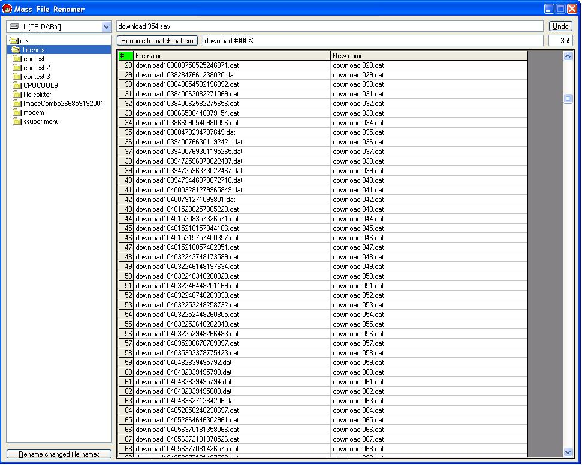



## Mass File Renamer

### Description

Renames large amounts of files to a specific filename or an editable pattern.

Added auto rename, changes stuff like sailor_moon.ep1.divx.avi to Sailor Moon - 01.avi

Made especially for anime (or tv series)

Added move with unique filenames

have many folders with files with the same filename? This will let you move them all into one folder for easy storage/accessabilty by making the filename unique to the new folder.

Made especially for manga (or comics)

Added shell enhancements

Dont wanna load the program to auto rename a file? Right click 'Apply pattern' then click 'Enhance Shell' to add the programs functionality to the shell via context menus
 
### More Info
 

             |
---                |---
**Submitted On**   |2003-10-06 22:59:06
**By**             |[Techni Rei Myoko](https://github.com/Planet-Source-Code/PSCIndex/blob/master/ByAuthor/techni-rei-myoko.md)
**Level**          |Intermediate
**User Rating**    |3.8 (19 globes from 5 users)
**Compatibility**  |VB 6\.0
**Category**       |[Complete Applications](https://github.com/Planet-Source-Code/PSCIndex/blob/master/ByCategory/complete-applications__1-27.md)
**World**          |[Visual Basic](https://github.com/Planet-Source-Code/PSCIndex/blob/master/ByWorld/visual-basic.md)
**Archive File**   |[Mass\_File\_1654791062003\.zip](https://github.com/Planet-Source-Code/techni-rei-myoko-mass-file-renamer__1-42721/archive/master.zip)

